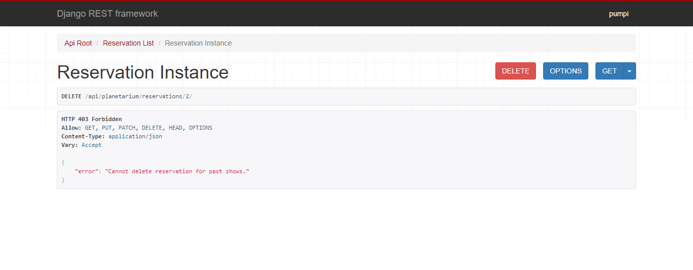
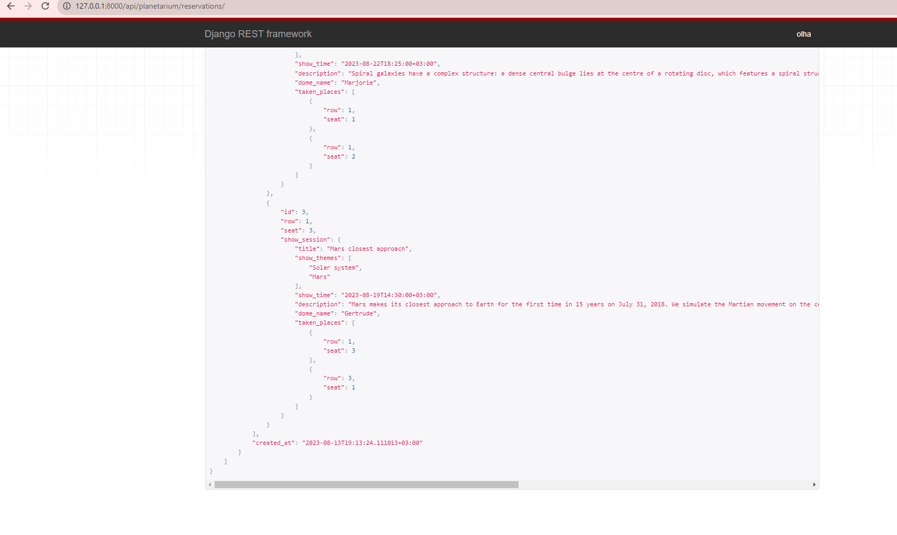
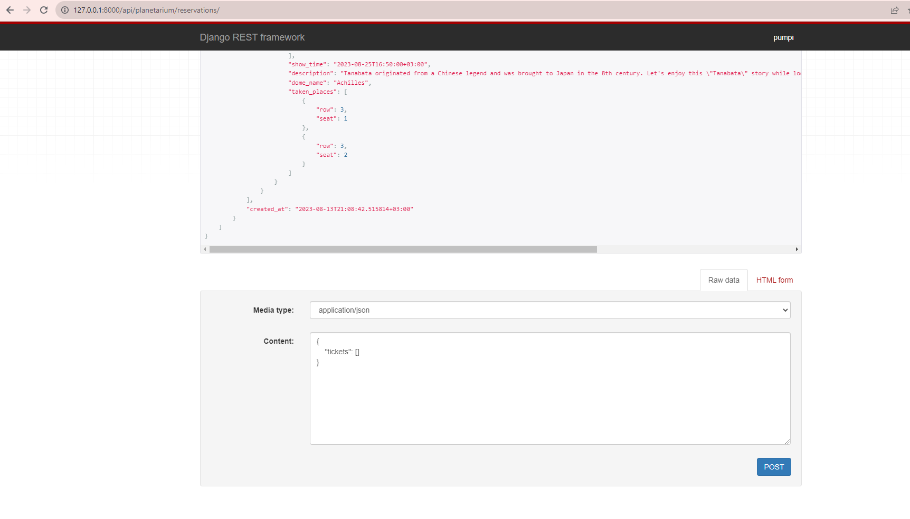

# Planetarium Api project


## Description

API-project for managing planetarium show sessions, making reservations

## Table of content

- [Features](#features)
- [Installation](#installation)
- [Dockerize](#dockerize)
- [Usage](#usage)
- [Demo](#demo)

## Features

All users:

    - Registration (only as client of planetarium, not admin)
    - Authorisation
    - Review and updating current authorisated user's profile info
    - Review all show sessions

General users:

    - Rewiew of all their owns reservations
    - Creating new reservations
    - Deleting reservation if it doesn't contain tickets for past show sessions 

Admins:

    - Managing planetarium info (about themes, shows, sessions, etc.)

## Installation
Python3 must be already installed
1. Clone the repository to your local machine:
    ```bash
    git clone https://github.com/OlhaTryhub/planetarium-api.git
    ```
2. Change into the project directory:
    ```bash
   cd your-repo
    ```
3. Create and activate a virtual environment (optional but recommended):
   ```bash
    python -m venv venv
    venv\Scripts\activate  # On Mac, use: source venv/bin/activate
   ```
4. Install the required dependencies:
    ```bash
    pip install -r requirements.txt 
    ```
5. Add following environment variables:
    ```bash
    DJANGO_SETTINGS_MODULE=planetarium_services.settings
    DJANGO_SECRET_KEY=yourSecret_KeY
    ```
6. Apply database migrations:
    ```bash
    python manage.py migrate
    ```

## Dockerize
Build images:

```bash
docker-compose build
```
Run app inside container:

```bash
docker-compose up
```
Stop app inside container:
```bash
docker-compose down
```

## Usage
1. For using app as admin you must create your own superuser with command:
    ```bash
    python manage.py createsuperuser
    ```
2. Start your local Django REST server:
    ```bash
    python manage.py runserver
    ```
3. Open your web browser and navigate to http://127.0.0.1:8000/ to access the application.

_To see all available endpoints navigate to one of next endpoint:_ 

    - http://127.0.0.1:8000/api/doc/swagger/
    - http://127.0.0.1:8000/api/doc/redoc/

**NOTE**: You have to have superuser credentials for access. You can use ModHeader.

## Demo

**Show session list:**


If general user tries to delete reservation with ticket for past show session:



**Reservations list**


Admins:



General users:


